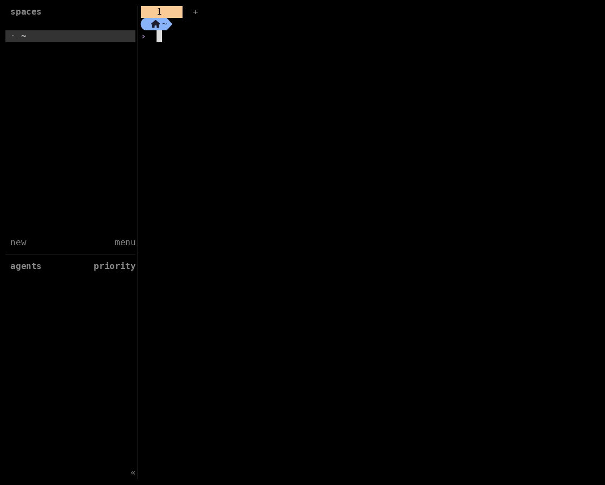

# Kubeflock

Kubeflock creates personal Kubernetes sandboxes and connects them to Herdr. Connections travel through the Kubernetes API, so Sandboxes need no public SSH service or direct workstation route.




## Requirements

- Go 1.27 or newer
- Herdr 0.9.0 or newer
- Helm 3
- A kubeconfig for a cluster with Agent Sandbox `v1beta1`, gVisor, and persistent storage

## Install

Build and push the starter Sandbox image, or use a compatible custom image:

```bash
docker build --tag REGISTRY/kubeflock-sandbox:VERSION sandbox-image
docker push REGISTRY/kubeflock-sandbox:VERSION
```

Set `sandbox.image` in your values file to that tag or digest. See [`sandbox-image/README.md`](sandbox-image/README.md) for the image contents and authentication model.

```bash
go build -o bin/kubeflock ./cmd/kubeflock
go install ./cmd/kubeflock
herdr plugin link .
```

Prepare a values file and install the cluster resources:

```bash
cp charts/kubeflock/values.example.yaml values.yaml
helm upgrade --install kubeflock charts/kubeflock \
  --namespace kubeflock-system \
  --create-namespace \
  --values values.yaml \
  --wait
```

The chart creates the developer namespace, access rules, budgets, Sandbox template, and zero-replica warm pool. See [`charts/kubeflock/README.md`](charts/kubeflock/README.md) for values, controller installation, and GitOps use.

## Configure

### Set the target

```bash
kubeflock cluster config --context NAME --namespace NAME
```

The saved context remains authoritative when the current kubectl context changes.

### Show the target

```bash
kubeflock cluster config show [--output text|json]
```

### Check the target

```bash
kubeflock cluster check [--timeout 60s] [--output text|json]
```

## Sandboxes

### Create and connect

```bash
kubeflock sandbox create my-agent \
  --template dev-small \
  --identity ~/.ssh/id_ed25519
```

Creation retries reuse the saved Claim, Sandbox, PVC, and Herdr identities.

### Restore a retained home

```bash
kubeflock sandbox create my-agent \
  --home 330cc485-d9e2-4ddd-8144-fa893496188a \
  --template dev-small \
  --identity ~/.ssh/id_ed25519
```

Restore uses the template recorded at deletion. Kubeflock prints that template image before it authorizes attachment. Restore requires the original sandbox name, because Agent Sandbox derives the PVC name from it, so a plain create under that name fails and names the UID to select. Without `--home`, Kubeflock never adopts retained data.

### List sandboxes

```bash
kubeflock sandbox list [--output text|json]
```

Kubeflock reports `provisioning`, `ready`, `failed`, and `disconnected` lifecycle states.

### Connect

```bash
kubeflock sandbox connect NAME --identity PATH
```

A first connection pins that Sandbox's host key and needs the identity file.

### Reconnect

```bash
kubeflock sandbox reconnect [NAME]
```

Reconnect takes no flags. A changed host key is refused rather than pinned again.

### Stop

```bash
kubeflock sandbox stop [NAME] [--timeout 5m]
```

Stopping terminates compute after Herdr detaches and retains the persistent home.

### Resume

```bash
kubeflock sandbox resume [NAME] [--timeout 5m]
```

Resuming starts a new Pod from the existing Sandbox and reconnects with the saved host-key pin.

### Delete

```bash
kubeflock sandbox delete [NAME] [--timeout 5m]
```

Deleting stops compute, orphan-deletes the Claim and Sandbox with UID preconditions, and records the surviving PVC as a retained home. Kubeflock never deletes a PVC, and it copies no private keys, repository credentials, model credentials, or SSH agents into a Sandbox.

### List retained homes

```bash
kubeflock sandbox home list [--output text|json]
```

Homes are listed by PVC name and UID, with their origin, template, capacity, storage class, and state. The list covers the configured target only, so homes recorded for another context or namespace stay hidden. A home shows `restoring` when an interrupted restore left its record behind, and a retry finishes the attachment. A `deleting` home also shows the exact residual PV identity.

### Permanently delete a retained home

```bash
kubeflock sandbox home delete PVC_UID [--confirm PVC_UID] [--timeout 5m]
```

Kubeflock shows the target, PVC identity, capacity, storage class, PV, and data-loss warning before requiring the exact PVC UID. Scripts must pass the same UID through `--confirm`. The command refuses allocated, mounted, restoring, replaced, or ambiguously owned storage. It also refuses a `Retain` reclaim policy because Kubernetes cannot confirm deletion of the underlying storage asset. For `Delete`, Kubeflock records the exact PVC and PV identities, deletes only that PVC with a UID precondition, and reports success only after both objects disappear. A failed attempt remains listed as `deleting` with its residual PV for a safe retry.

### Disconnect

```bash
kubeflock sandbox disconnect [NAME]
```

Disconnecting leaves the Sandbox and its remote processes running.

Herdr provides matching lifecycle, restore, listing, and permanent home deletion actions.
